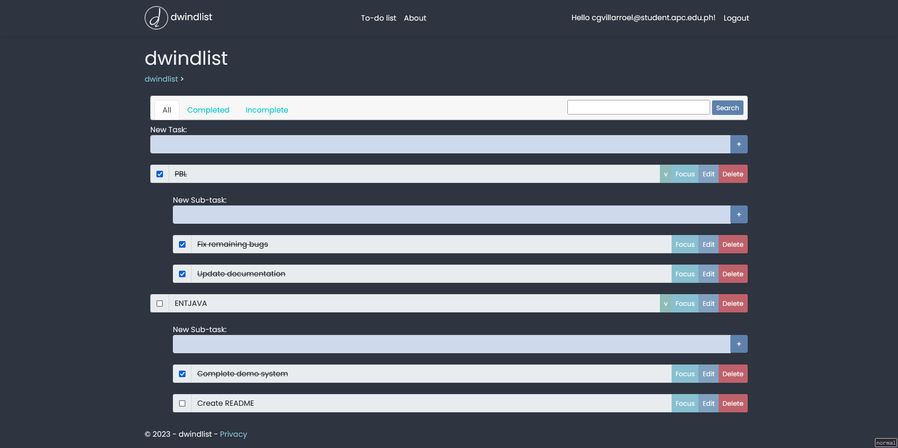

# dwindlist

A to-do list webapp that encourages breaking down tasks.



Note: I'm still learning Git, so I might've accidentally duped some commits. Oops.

## Why?

To-do lists help you keep track of tasks, and that's pretty much it. This is helpful for some, but not for others. Some to-do list apps motivate users by gamifying the process. But what if the problem is the paralysis of being overwhelmed and not motivation?

One method of tackling overwhelming tasks is by breaking them down into smaller tasks. This is what dwindlist aims to encourage.

## Features and Roadmap

Currently, dwindlist is still in the early stages of development. However, some basic key features are already available. With more time, the developers aim to improve the experience.

- [ ] List management
	- [x] Ability to add, edit, and delete items
	- [x] Unlimited nesting
	- [x] Automatic checking (parent is checked <=> all children are checked)
	- [x] Navigation
		- [x] Breadcrumbs
		- [x] Filters
		- [x] Search
	- [ ] Sorting
	- [ ] Priorities
	- [ ] Deadlines and reminders
- [ ] Gamification
	- [ ] Incentives and rewards
	- [ ] Leveling

## Implementation Write-up

You can view the design decisions and implementation write-up [here](https://gist.github.com/ChuseCubr/10883566d0c3fffdfd101c9662f4e331).

## Dependencies

- .NET SDK
- SQL Server with LocalDB

## Usage

This application uses a database set up with Code First. To make the database, run the following:

```pwsh
cd dwindlist
dotnet ef database update
```

To run, use `dotnet run` or `dotnet watch`
